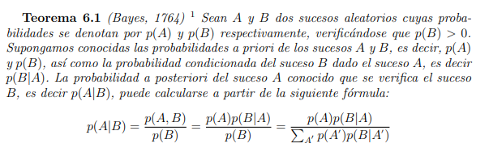

# Chapter III: Real world AI.

## Odds and probability

**Clave:** *"En el mundo real la información no es perfecta."*

Los sistemas en que analizamos en la vida real no son sistemas cerrados en los que podemos predecir con más o menos complejidad los futuros estados del mismo. Debido a esto necesitamos lidiar con el factor de la incertidumbre. El Vocabulario de Metrología Internacional, VIM [BIPM, 1993] define la incertidumbre como

```
“un parámetro, asociado al resultado de una medida, que caracteriza el intervalo de valores que puede ser razonablemente atribuidos al mensurando”.
En esta definición el mensurando indica: “la propiedad sujeta a medida” [BIPM 1993].
                                            
                                                Source: http://www.quimica.urv.es/quimio/general/incert.pdf
```
Podemos encontrar los siguientes tipos de incertidumbre:
(Fuente: Alvaro Torres, "¿INFERENCIA Y RAZONAMIENTO PROBABILÍSTICO O DIFUSO?")

1. **El determinismo.** Corresponde con el conocimineto perfecto de los resultados y de la ocurrencia de eventos.
2. **La aleatoriedad.** Se presenta cuando los posibles eventos resultantes de un experiminto son conocidos. Ej.: Lanzamiento de dados o de una moneda. Se ha modelado con la teoría de la icertidumbre.
3. **La ambigüedad o no especificidad.**  proviene de la existencia de diferentes significados de una palabra o de una expresión. En este caso los eventos no están especificados o definidos claramente. Corresponde a la falta de información y se da cuando existe una relación de uno a muchos. Se puede modelar con lógica difusa.
4. **La vaguedad.**  Hace imposible establecer la verdad o falsedad de una afirmación. La vaguedad difiere en general de la ambigüedad en que esta última envuelve diferentes significados incompatibles y puede resolverse con mayor información. Una mayor cantidad de información no ayuda en general a resolver el problema de vaguedad como sí sucede en el caso de la ambigüedad. Se puede modelar con lógica difusa.
5. **La confusión.**  Es un tipo de incertidumbre de conflicto, que reúne características tanto ambiguas como vagas.

Existen numerosas técnicas para resolver la incertidumbre en problemas de IA, en este capítulo nos hablan de la probabilidad. En este punto de aprendizaje, no es importante aprender los métodos diferentes matemáticos pero si entender que la incertidumbre se puede cunatificar haciendola alcanzable por el pensamiento racional.

La probabilidad es una medida de la certidumbre asociada a un suceso o evento futuro y suele expresarse como un número entre 0 y 1 (o entre 0 % y 100 %).
Una forma tradicional de estimar algunas probabilidades sería obtener la frecuencia de un acontecimiento determinado mediante la realización de experimentos aleatorios, de los que se conocen todos los resultados posibles, bajo condiciones suficientemente estables. Un suceso puede ser improbable (con probabilidad cercana a cero), probable (probabilidad intermedia) o seguro (con probabilidad uno).
(Source: https://es.wikipedia.org/wiki/Probabilidad)


## The Bayes rule
Las redes Bayesianos nos permiten crear modelos probabilísticos de la realidad. A partir de unas evidencias (variables aleatorias observables) permite realizr razonamientos sobre variables desconocidas.

```
"Modelo gráfico probabilístico que permite descubrir distribuciones conjuntas complejas (modelo) a partir de distribuciones condicionales locales simples"
```

La forma más simple de expresar la regla de Bayes es en términos de probabilidades. La idea es tomar las probabilidades de que algo suceda (en contra de que no suceda), que escribiremos como probabilidades anteriores. La palabra anterior se refiere a nuestra evaluación de las probabilidades antes de obtener información nueva que pueda ser relevante. El propósito de la fórmula es actualizar las probabilidades anteriores cuando haya nueva información disponible, para obtener las probabilidades posteriores o las probabilidades después de obtener la información
El teorema de Bayes es de enorme relevancia puesto que **vincula la probabilidad de A dado B con la probabilidad de B dado A.** Es decir, por ejemplo, que sabiendo la probabilidad de tener un dolor de cabeza dado que se tiene gripe, se podría saber (si se tiene algún dato más), la probabilidad de tener gripe si se tiene un dolor de cabeza.



Para simplificar los cálculos, Bayes usa la independencia condicional:

- si a y c son independientes: P(a|b,c) = P(a|b)
- si a y b son independientes: P(a,b|c) = P(a|c)*P(b|c)

En la realidad, la independencia total es muy raro que se presente en los sistemas, pero la independencia condicional es bastante común.

**Índice de probabilidad** Es la probabilidad de la observación en caso de que ocurra un evento de interés (en lo anterior), dividido por la probabilidad de la observación en caso de que no ocurra ningún evento (en lo anterior). 

Según la regla de Bayes podemos convertir la probabilidades anteriores en probabilidades posteriores de la siguiente manera:

```
(probabilidades anteriores) = (Índice de probabilidad) x (probabilidades anteriores)
```

Ejemplos de utilización: Lluvia, cancer.


## Naïve Bayes classification
 
El objetivo es crear un modelo, a partir de un conjunto de entrenamiento, que sea capaz de clasificar ejemplos no vistos.
Presupondremos que la clase de los ejemplos de entrenamiento viene dada por los valores en forma discreta o continua por lo que tendremos que utilizar diferentes técnicas en base a esta propiedad:
Naïve Bayes se basará en estimar la probabilidad de pertenencia a una clase con las probabilidades condicionadas, mediante el teorema de Bayes.
La principal característica de este tipo de clasificadors es que el modelo generado es capaz de predecir con máxima probabilidad los ejemplos de entrenameinto.

El origen de la denominación de Naïve, viene de presuponer las siguientes hipótesis:

- Independencia estadística de los atributo. Aquella que establece que el valor de todos y cada uno de ellos es independiente, conocido el valor de la clase.
- En relación a los atributos numéricos, todos ellos pueden ser modelados mediante una distribución normal.
- Cada instancia de netrenamiento debe pertenecer a una clase.

A pesar de estas restricciones, la evidencia demuestra que este clasificados se comporta bastante bien en muchos problemas complejos del mundo real.

Principales ventajas:

- No requiere de grandes cantidades de ejemplos de entrenamiento.
- El tiempo de entrenamiento y consumos de CPU requeridos para generarlos es más pequeño que en la mayoría de otros métodos de aprendizaje.
- El desacoplamiento de las distribuciones de características condicionales de clase significa que cada distribución puede ser estimada independientemente como si tuviera una sola dimensión.

Principales desventajas:

- Falta ded interpretabilidad lingüistica del modelo aprendido. (Frente a ejemplos como los ID3)
- Aunque son clasificadores buenos, no se deben tomar en serio las probabilidades que se obtienen. 
- Cuando el conjunto de datos de prueba tiene una caracter´sitica que no ha sido obserbada en el conjunto de entrenamiento, el modelo le asignará una probabilidad de cero y será inútil realizar predicciones. 

En términos simples, un clasificador de Bayes ingenuo asume que la presencia o ausencia de una característica particular no está relacionada con la presencia o ausencia de cualquier otra característica, dada la clase variable. Por ejemplo, una fruta puede ser considerada como una manzana si es roja, redonda y de alrededor de 7 cm de diámetro. Un clasificador de Bayes ingenuo considera que cada una de estas características contribuye de manera independiente a la probabilidad de que esta fruta sea una manzana, independientemente de la presencia o ausencia de las otras características.
(Source: https://es.wikipedia.org/wiki/Clasificador_bayesiano_ingenuo)

A continuación se listan los pasos que hay que realizar para poder utilizar el algoritmo Naive Bayes en problemas de clasificación:

1. Convertir el conjunto de datos en una tabla de frecuencias.
2. Crear una tabla de probabilidad calculando las correspondientes a que ocurran los diversos eventos.
3. La ecuación Naive Bayes se usa para calcular la probabilidad posterior de cada clase.
4. La clase con la probabilidad posterior más alta es el resultado de la predicción.


ENLACES:
- https://medium.com/datos-y-ciencia/algoritmos-naive-bayes-fudamentos-e-implementaci%C3%B3n-4bcb24b307f
- http://naivebayes.blogspot.com/
- http://www.sc.ehu.es/ccwbayes/docencia/mmcc/docs/t6bayesianos.pdf
- https://github.com/PrACiDa/EBAD/blob/master/01_Teorema_de_Bayes_e_inferencia_estad%C3%ADstica.ipynb
- https://www.datacamp.com/community/tutorials/naive-bayes-scikit-learn
- https://jakevdp.github.io/PythonDataScienceHandbook/05.05-naive-bayes.html
- https://medium.com/dataseries/lets-build-your-first-naive-bayes-classifier-with-python-d31a5140e4bc


Aplicaciones mundo real:
- Filtros de spam.  (https://pdfs.semanticscholar.org/2021/61ac4674000870a0d450c6410f140f42216c.pdf)


