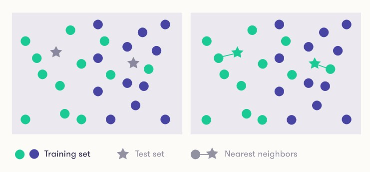

# Capitulo 4. Machine Learning.
Durante mucho tiempo se ha entendido que el aprendizaje es un elemento clave de la inteligencia. Esto es tanto para la inteligencia natural - todos nos hacemos más inteligentes aprendiendo - como para la inteligencia artificial.

## Los tipos de Inteligencia Artificial.
En los problemas de aprendizaje automático más comunes, únicamente un valor de clase es correcto a la vez. Esto también es cierto en el caso de MNIST (Modified National Institute of Standars and Technology), aunque la respuesta correcta, a menudo, puede ser dificil de decir. En este tipo de problemas (reconocimiento escritura manual) no es posible que una instancia pertenezca a varias clases (o ninguna en absoluto) al mismo tiempo.

### Tres tipos de "Machine Learning".
Las raíces del aprendizaje automático están en las estadísticas, que también se puede considerar como el arte de extraer conocimiento de los datos. Especialmente métodos como la regresión lineal y las estadísticas bayesianas, que ya tienen más de dos siglos!, están incluso hoy en día en el corazón del aprendizaje automático. Para obtener más ejemplos y una breve historia, consulte [la línea de tiempo del aprendizaje automático](https://en.wikipedia.org/wiki/Timeline_of_machine_learning) (Wikipedia).

El área de aprendizaje automático a menudo se divide en subáreas de acuerdo con los tipos de problemas que se atacan. Una categorización aproximada es la siguiente:
- **Aprendizaje supervisado** (Supervised Learning). Se nos da una entrada, por ejemplo, una fotografía con una señal de tráfico, y la tarea es predecir la salida o etiqueta correcta, por ejemplo, que la señal de tráfico esté en la imagen (límite de velocidad, señal de stop, etc.). En los casos más simples, las respuestas son en forma de si/no (llamamos a estos problemas de clasificación binaria).
- **Aprendizaje no supervisado** (Unsupervised Learning). No hay etiquetas ni salidas correctas. La tarea consiste en descubrir la estructura de los datos: por ejemplo, agrupar elementos similares para formar "clusters" o reducir los datos a un pequeño número de "dimensiones" importantes. La visualización de datos también puede ser considerado como aprendizaje no supervisado.
- **Aprendizaje de refuerzo** (Reinforcement learning). Comúnmente utilizado en situaciones donde un agente de IA, como un coche autónomo, debe operar en un entorno donde la retroalimentación sobre buenas o malas opciones está disponible con algún retraso. También se utiliza en juegos donde el resultado se puede decidir solo al final del juego.

Las categorías estan algo superpuestas y difusas, por lo que un método en particular a veces puede ser dificil de colocar en una categoria. Por ejemplo, como su nombre indica, el llamado "aprendizaje semisupervisado" está parcialmente supervisado y en parte no supervisado.

>**Clasificación**. Cuando se trata de aprendizaje autómatico, nos centraremos principalmente en el aprendizaje supervisado y, en particular, en las tareas de clasificación. En la clasificación, observamos en la entrada la fotografía de una señal de tráfico y tratamos de inferir su "clase", como el tipo de señal (límite de velocidad, paso de peatones, señal de stop, etc.). Otro ejemplo de tareas de clasificación es la identificación de cuentas falsas de Twitter (la entrada incluye la lista de seguidores, la velocidad a la que han empezado a seguir la cuenta y la CLASE es o una cuenta falsa o una real).

### Humanos enseñando a máquinas.
En lugar de escribir manualmente las reglas exactas para hacer la clasificación, el punto en el aprendizaje automático supervisado es tomar una serie de ejemplos, etiquetar cada uno por la etiqueta correcta y usarlos para "entrenar" un método de IA para reconocer automáticamente la etiqueta correcta para el ejemplos de formación, así como (al menos con suerte) cualquier otra imagen. Esto, por supuesto, requiere que se proporcionen las etiquetas correctas, por lo que hablamos de aprendizaje supervisado. El usuario que proporciona las etiquetas correctas es un supervisor que guía el algoritmo de aprendizaje hacia respuestas correctas para que, finalmente, el algoritmo pueda producirlas de forma independiente.

Además de aprender a predecir la etiqueta correcta en un problema de clasificación, el aprendizaje supervisado también se puede utilizar en situaciones donde el resultado previsto es un número. Algunos ejemplos son predecir el número de personas que harán clic en un anuncio de Google en función del contenido del anuncio y los datos sobre el comportamiento en línea anterior del usuario, predecir el número de accidentes de tráfico en función de las condiciones de la carretera y el límite de velocidad, o predecir el precio de venta de bienes raíces en función de su ubicación, tamaño y condición. Estos problemas se denominan regresión. Probablemente reconozca el término regresión lineal, que es una técnica clásica, todavía muy popular para la regresión.

>**Ejemplo**. Supongamos que tenemos un conjunto de datos que consta de datos de ventas de apartamentos. Para cada compra, obviamente tendríamos el precio que se pagó, junto con el tamaño del apartamento en metros cuadrados (o pies cuadrados, si lo desea), y el número de dormitorios, el año de construcción, la condición (en una escala de "desastre" a "spick y span") . A continuación, podríamos usar el aprendizaje automático para entrenar un modelo de regresión que predice el precio de venta basado en estas características. Se puede ver un ejemplo real [aqui](http://kannattaakokauppa.fi/#/en/)

>**¡Demasiado apto para ser verdad! Alerta de sobreajuste**
>Es muy importante tener en cuenta que la precisión de un predictor aprendido por el aprendizaje automático puede ser muy diferente en los datos de entrenamiento y en datos de prueba separados. Este es el llamado fenómeno de sobreajuste, y una gran cantidad de investigación de aprendizaje automático se centra en evitarlo de una manera u otra. Intuitivamente, sobreadaptar significa tratar de ser demasiado inteligente. Al predecir el éxito de una nueva canción de un artista conocido, puedes ver el historial de las canciones anteriores del artista, y llegar a una regla como "si la canción es sobre el amor, e incluye un coro pegadizo, será top-20". Sin embargo, tal vez hay dos canciones de amor con coros pegadizos que no llegaron al top-20, así que decides continuar con la regla "... excepto si se menciona Suecia o yoga" para mejorar su regla. Esto podría hacer que su regla se ajuste perfectamente a los datos anteriores, pero de hecho podría hacer que funcione peor en los datos de prueba futuros.
Los métodos de aprendizaje automático son especialmente propensos a sobreadaptarse, ya que pueden probar un gran número de diferentes "reglas" hasta que se encuentre perfectamente uno que se ajuste perfectamente a los datos de entrenamiento. Especialmente los métodos que son muy flexibles y pueden adaptarse a casi cualquier patrón en los datos pueden sobreajustarse a menos que la cantidad de datos es enorme. Por ejemplo, en comparación con los modelos lineales bastante restringidos obtenidos por regresión lineal, las redes neuronales pueden requerir grandes cantidades de datos antes de producir predicciones confiables.

### Aprendiendo sin un profesor: aprendizaje no supervisado.
Arriba discutimos el aprendizaje supervisado donde las respuestas correctas están disponibles, y la tarea del algoritmo de aprendizaje automático es encontrar un modelo que las predice en función de los datos de entrada.

En el aprendizaje no supervisado, no se proporcionan las respuestas correctas. Esto hace que la situación sea muy diferente, ya que no podemos construir el modelo haciendo que se ajuste a las respuestas correctas en los datos de entrenamiento. También hace que la evaluación del rendimiento sea más complicada, ya que no podemos comprobar si el modelo aprendido va bien o no.

Los métodos de aprendizaje no supervisados típicos intentan aprender algún tipo de "estructura" subyacente a los datos. Esto puede significar, por ejemplo, una visualización en la que elementos similares se colocan cerca uno del otro y elementos diferentes más alejados entre sí. También puede significar la agrupación en clústeres donde usamos los datos para identificar grupos o "clústeres" de elementos que son similares entre sí, pero diferentes de los datos de otros clústeres.

>Como ejemplo concreto, las cadenas de tiendas de comestibles recopilan datos sobre el comportamiento de compra de sus clientes (es por eso que tiene todas esas tarjetas de fidelización). Para entender mejor a sus clientes, la tienda puede visualizar los datos utilizando un gráfico donde cada cliente está representado por un punto y los clientes que tienden a comprar los mismos productos se colocan más cerca uno del otro que los clientes que compran diferentes productos. O bien, la tienda podría aplicar la agrupación para obtener un conjunto de grupos de clientes como "entusiastas de la comida saludable de bajo presupuesto", "amantes de los pescados de alta gama", "soda y pizza 6 días a la semana", etc. Tenga en cuenta que el método de aprendizaje automático solo agruparía a los clientes en clústeres, pero no generaría automáticamente las etiquetas de clúster ('amantes del pescado', etc.). Esta tarea se dejaría para el usuario.

Sin embargo, otro ejemplo de aprendizaje no supervisado se puede denominar modelado generativo (generative modeling). Esto se ha convertido en un enfoque prominente desde los últimos años como una técnica de aprendizaje profundo llamada redes adversarias generativas (GAN - Generative Adversarial Networks) ha llevado a grandes avances. Dados algunos datos, por ejemplo, fotografías de los rostros de las personas, un modelo generativo puede generar más de lo mismo: imágenes más reales pero artificiales de los rostros de las personas.

## El clasificador de vecinos más cercanos.
Este clasificador se encuentra entre los clasificadores más simples posibles. Cuando se le asigna un elemento para clasificar, encuentra el elemento de datos de entrenamiento más similar al nuevo elemento y genera su etiqueta.

|  |
|:--:|
| *Grafico para la apliación de algoritmo de Vecino más Cercano*

En el diagrama anterior, mostramos una colección de elementos de datos de entrenamiento, algunos de los cuales pertenecen a una clase (verde) y otros a otra clase (azul). Además, hay dos elementos de datos de prueba, las estrellas, que vamos a clasificar utilizando el método de vecino más cercano.

Los dos elementos de prueba se clasifican en la clase "verde" porque sus vecinos más cercanos son verdes (véase el diagrama b) anterior).

La posición de los puntos en el trazado representa de alguna manera las propiedades de los elementos. Puesto que dibujamos el diagrama en una superficie bidimensional plana – puede moverse en dos direcciones independientes: arriba-abajo o izquierda-derecha – los elementos tienen dos propiedades que podemos usar para la comparación. Imagínese, por ejemplo, representar a los pacientes en una clínica en términos de su edad y nivel de azúcar en la sangre. Pero el diagrama anterior debe tomarse como una herramienta visual para ilustrar la idea general, que es relacionar los valores de clase con la similitud o proximidad (proximidad). La idea general no se limita de ninguna manera a dos dimensiones y el clasificador vecino más cercano se puede aplicar fácilmente a los elementos que se caracterizan por muchas más propiedades que dos.

Una pregunta interesante relacionada con (entre otras cosas) el clasificador vecino más cercano es la definición de distancia o similitud entre instancias. En la ilustración anterior, asumimos tácitamente que se utiliza la distancia geométrica estándar, técnicamente llamada distancia euclidiana. Esto simplemente significa que si los puntos se dibujan en una hoja de papel (o se muestran en la pantalla), puede medir la distancia entre dos elementos cualquiera tirando de un trozo de rosca directamente de uno a otro y midiendo la longitud.

El uso de la distancia geométrica para decidir cuál es el elemento más cercano puede no ser siempre razonable o incluso posible: el tipo de la entrada puede, por ejemplo, ser texto, donde no está claro cómo se dibujan los elementos en una representación geométrica y cómo se deben medir las distancias . Por lo tanto, debe elegir la métrica de distancia caso por caso.

### Uso de vecinos más cercanos para predecir el comportamiento del usuario
Un ejemplo típico de una aplicación del método vecino más cercano es predecir el comportamiento del usuario en aplicaciones de IA, como los sistemas de recomendación.

La idea es usar el principio muy simple de que los usuarios con un comportamiento pasado similar tienden a tener un comportamiento futuro similar. Imagine un sistema de recomendación de música que recopile datos sobre el comportamiento de escucha de los usuarios. Digamos que has escuchado música disco de la década de 1980 (sólo por el bien de la discusión). Un día, el proveedor de servicios tiene en sus manos un clásico disco difícil de encontrar 1980, y lo agrega a la biblioteca de música. El sistema ahora necesita predecir si le gustará o no. Una forma de hacerlo es usar información sobre el género, el artista y otros metadatos, introducidos por las buenas personas del proveedor de servicios. Sin embargo, esta información es relativamente escasa y gruesa y sólo será capaz de dar predicciones aproximadas.

Lo que utilizan los sistemas de recomendación actuales en lugar de los metadatos introducidos manualmente, es algo llamado filtrado colaborativo. El aspecto colaborativo de la misma es que utiliza los datos de otros usuarios para predecir sus preferencias. La palabra "filtro" se refiere al hecho de que solo se le recomendará contenido que pasa a través de un filtro: el contenido que es probable que disfrute pasará, otro contenido no (este tipo de filtros pueden conducir a las llamadas burbujas de filtro, que mencionamos en Capítulo 1. Volveremos a ellos más tarde).

Ahora digamos que otros usuarios que han escuchado música disco de los años 80 disfrutan del nuevo lanzamiento y siguen escuchándolo una y otra vez. El sistema identificará el comportamiento pasado similar que usted y otros fanáticos de la discoteca de los años 80 comparten, y como otros usuarios como usted disfrutan de la nueva versión, el sistema predecirá que usted también lo hará. Por lo tanto, aparecerá en la parte superior de su lista de recomendaciones. En una realidad alternativa, tal vez la canción añadida no es tan grande y otros usuarios con un comportamiento pasado similar al tuyo no les gusta realmente. En ese caso, el sistema no se molestaría en recomendarlo a usted, o al menos no estaría en la parte superior de la lista de recomendaciones para usted.

## Regresion.
Nuestro principal objetivo de aprendizaje en esta sección es otro buen ejemplo de métodos de aprendizaje supervisado, y casi tan simple como el clasificador de vecino más cercano: Regresión Lineal (linear regression). También presentaremos a su primo cercano, la regresión logística (logictic regression).

> **Diferencia entre Clasificación y Regresion**. Hay una pequeña pero importante diferencia en el tipo de predicciones que podemos producir en distintos escenarios. Mientra que, por ejemplo, el clasificador "vecino más cercano" elige una etiqueta de clase para cualquier elemento de un conjunto determinado de alternativas (como spam/no spam, 0-1-2...9), la regresión lineal produce una predicción numérica que no está restringida a ser un entero (un número entero en lugar de algo así como 3.14). Por lo tanto, la regresión lineal es más adecuada en situaciones en las que la variable de salida puede ser cualquier número, como el precio de un producto, la distancia a un obstáculo, los ingresos de taquilla de una próxima película, etc.

La idea básica en la Regresión Lineal es sumar los efectos de cada una de las variables de entidad para producir un valor predecible. El término técnico para el proceso de suma es **"combinación lineal"**.

> **Pensando en la Regresión Lineal como una factura de compra**. Supongamos que va al supermercado y compra 2.5kg de patatas, 1kg de Zanahorias y dos botellas de leche. La factura sería igual a 2.5 × 2€ + 1.0 × 4€ + 2 × 3€ = 15€. En la Regresión Lineal, la cantidad de patatas, zanahorias y leche son las entradas de datos. El resultado es el costo de sus compras que, claramente, depende tanto del precio como de la cantidad de cada producto que compre.

La palabra **lineal** significa que el aumento en la salida, cuando una característica de la entrada se incrementa en una cantidad fija, es siempre la misma. En otras palabras, cada vez que agrega, digamos, dos kg de zanahorias a su cesta de la compra, la factura sube 8€. Cuando agrega otros dos kg, la factura sube otros 8€, y si agrega la mitad, 1kg, la factura sube exactamente la mitad, 4€.

> **Coeficientes o pesos**. En la terminología de regresión lineal, los precios de los diferentes productos se llamarían coeficientes o pesos (esto puede parecer confuso ya que medimos la cantidad de papas y zanahorias en peso, pero no se deje engañar por esto). Una de las principales ventajas de la regresión lineal es su fácil interpretación: los pesos aprendidos pueden ser más interesantes que las predicciones de los resultados.
Por ejemplo, cuando usamos la regresión lineal para predecir la esperanza de vida, el peso de fumar (cigarrillos por día) es aproximadamente menos medio año, lo que significa que fumar un cigarrillo más por día lo lleva en promedio medio año más cerca de la terminación. Del mismo modo, el peso del consumo de verduras (un puñado de verduras por día) tiene un peso más un año, por lo que comer un puñado de verduras cada día le da, en promedio, un año más.

Para el ejemplo de la esperanza de vida en base a fumar y alimentación, la esperanza de vida de las mujeres que no fuman y que odian las verduras es de 80 años y éste fue el punto de partida para el cálculo. El término técnico para el punto de partida es la **intersección**.

### Aprendiendo Regresión Lineal.
Continuando con la analogía de compras, supongamos que se nos dío el contenido de una seria de cestas de la compra y la factura total para cada una de ellas, y se nos pidió que calcularamos el precio de cada uno de los productos (patatas, zanahorias, etc.). Por ejemplo, en una cesta tenemos 1kg de filetes de solomillo, 2kg de zanahorias y una botella de Chianti. Incluso si supieramos que la factura total es de 35€, no podríamos determinar los precios porque hay muchos conjuntos de precios que produciran el mismo total de factura. Sin embargo, con muchas cestas, generalmente podemos resolver el problema.

### Machine learning applications of linear regression
La regresión lineal es realmente el caballo de batalla de muchas aplicaciones de inteligencia artificial y ciencia de datos. Tiene sus límites, pero a menudo se ven compensados por su simplicidad, interpretabilidad y eficiencia. La regresión lineal se ha utilizado con éxito en los siguientes problemas para dar algunos ejemplos:
- predicción de tasas de clics en publicidad en línea.
- predicción de la demanda minorista de productos.
- predicción de los ingresos de taquilla de las películas de Hollywood.
- predicción del costo del software.
- predicción del costo del seguro.
- predicción de las tasas de criminalidad.
- predicción de precios inmobiliarios.

### ¿Podemos utilizar Regresión para predecir etiquetas?
Como discutimos anteriormente, la regresión lineal y el método vecino más cercano producen diferentes tipos de predicciones. La regresión lineal genera salidas numéricas mientras que el método vecino más cercano produce etiquetas a partir de un conjunto fijo de alternativas ("clases").

Donde la regresión lineal sobresale en comparación con los vecinos más cercanos es la interpretabilidad. ¿Qué queremos decir con esto? Se podría decir que, en cierto modo, el método de vecino más cercano y cualquier predicción que produzca son fáciles de interpretar: ¡es solo el elemento de datos de entrenamiento más cercano! Esto es cierto, pero cuando se trata de la interpretabilidad del modelo aprendido, hay una clara diferencia. Es imposible interpretar el modelo entrenado en los vecinos más cercanos de una manera similar a los pesos en la regresión lineal: el modelo aprendido es básicamente la totalidad de los datos, y generalmente es demasiado grande y complejo como para proporcionarnos mucha información. Entonces, ¿qué pasaría si quisiéramos tener un método que produzca el mismo tipo de resultados que el vecino más cercano, las etiquetas, pero que sea interpretable como una regresión lineal?

### Regresión Logistica al rescate.
Bueno, hay buenas noticias para usted: podemos convertir los resultados del método de regresión lineal en predicciones sobre etiquetas. La técnica para hacer esto se llama regresión logística. No entraremos en los tecnicismos, basta con decir que, en el caso más simple, tomamos el resultado de la regresión lineal, que es un número, y predecimos una etiqueta A si la salida es mayor que cero, y otra etiqueta B si la salida es menor o igual que cero. En realidad, en lugar de solo predecir una clase u otra, la regresión logística también puede darnos una medida de incertidumbre de la predicción. Entonces, si estamos prediciendo si un cliente comprará un nuevo teléfono inteligente este año, podemos obtener una predicción de que el cliente A comprará un teléfono con una probabilidad del 90%, pero para otro cliente menos predecible, podemos obtener una predicción de que no comprar un teléfono con un 55% de probabilidad (o en otras palabras, que comprarán uno con un 45% de probabilidad).

También es posible usar el mismo truco para obtener predicciones sobre más de dos etiquetas posibles, por lo que en lugar de predecir siempre sí o no (comprar un teléfono nuevo o no, noticias falsas o noticias reales, etc.), podemos usar regresión logística para identificar, por ejemplo, dígitos escritos a mano, en cuyo caso hay diez etiquetas posibles.

### Los límites de Machine Learning.
Los factores que afectan qué tan bueno es el resultado que podemos lograr incluyen:

- La dureza de la tarea: en el reconocimiento de dígitos escritos a mano, si los dígitos se escriben muy descuidadamente, incluso un humano no siempre puede adivinar correctamente lo que el escritor pretendía
- El método de aprendizaje automático: algunos métodos son mucho mejores para una tarea en particular que otros
- La cantidad de datos de entrenamiento: de solo unos pocos ejemplos, es imposible obtener un buen clasificador
- La calidad de los datos

También es importante enfatizar que los diferentes métodos de aprendizaje automático son adecuados para diferentes tareas. Por lo tanto, no existe un mejor método para todos los problemas ("un algoritmo para gobernarlos a todos ..."). Afortunadamente, uno puede probar una gran cantidad de métodos diferentes y ver cuál de ellos funciona mejor en el problema en cuestión.

Esto nos lleva a un punto que es muy importante pero que a menudo se pasa por alto en la práctica: lo que significa trabajar mejor. En la tarea de reconocimiento de dígitos, un buen método produciría la etiqueta correcta la mayor parte del tiempo. Podemos medir esto por el error de clasificación: la fracción de casos en los que nuestro clasificador genera la clase incorrecta. Al predecir los precios de los apartamentos, la medida de calidad suele ser algo así como la diferencia entre el precio previsto y el precio final por el que se vende el apartamento. En muchas aplicaciones de la vida real, también es peor equivocarse en una dirección que en otra: establecer el precio demasiado alto puede retrasar el proceso por meses, pero establecer el precio demasiado bajo significará menos dinero para el vendedor. Y para tomar otro ejemplo, no detectar a un peatón frente a un automóvil es un error mucho peor que detectarlo falsamente cuando no lo hay.

Como se mencionó anteriormente, generalmente no podemos lograr un error cero, pero tal vez estemos contentos con un error inferior a 1 en 100 (o 1%). Esto también depende de la aplicación: no estaría contento de tener solo un 99% de automóviles seguros en las calles, pero poder predecir si le gustará una nueva canción con esa precisión puede ser más que suficiente para una experiencia auditiva agradable . Tener en cuenta el objetivo real en todo momento nos ayuda a asegurarnos de crear un valor agregado real.