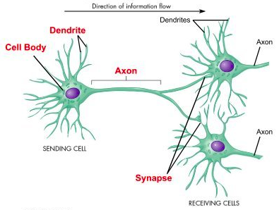
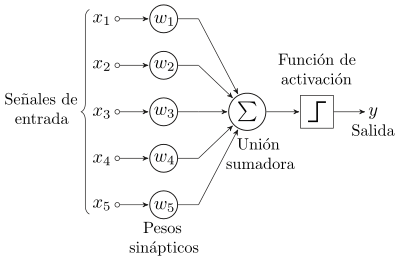

# Chapter V: Neural Networks

Las redes neuronales son un modelo computacional basado en las interconexiones entre neuronas del cerebro que están impulsando los avances en *Procesamiento del Lenguaje Natural (PLN)*, reconocimiento de imágenes y voz, etc. que son dificilmente programables en sistemas basados en reglas.

## I. Neural Networks Basics

**Deep learning** es un subconjunto de técnicas de Machine Learning donde diversas *capas* de procesamiento se conectan en un sistema en el que las salidas de cada capa actúan como las entradas del siguiente nivel. Esta abstracción de como funcionan las redes neuronales biológicas, junto a mayores capacidades de procesamiento y conjuntos de datos más amplios, nos permiten abordar problemas más complejos.

|  |
|:--:|
| *Anatomía de una neurona*

Cuando una neurona recibe una unidad de información (señal), la evalúa/procesa y la despacha hacia la siguiente neurona. Estos procesos pueden evolucionar a lo largo del tiempo.

La principal motivación para el desarrollo de las redes neuronales artificiales es alcanzar el conocimiento mediante el cual, con el suficiente nivel de detalle y capacidad de cómputo, seamos capaces de simular el funcionamiento de un cerebro real.

Actualmente existen dos iniciativas principales para lograr esta meta:

- *The Human Brain Project (HBP)*: Impulsado por la Unión Europea tiene por objetivo reproducir tecnológicamente el funcionamiento de un cerebro humano. 1.000 millones de euros para el período 2013-2023.
- *The BRAIN project*: Impulsado por USA con el objetivo de mapear la actividad de cada neurona en un cerebro humano. Presupuesto aproximado de 3.000 millones de dólares de 2013-2023.

Ambos han recibido críticas e informes desfavorables hasta ahora, catalogándolos de proyectos con expectativas poco realistas. A pesar de eso, sus contribuciones han permitido aumentar nuestro conocimiento en diversas áreas: entendimiento del Alzheimer, la epilepsia, tratar daños cerebrales e intentar repararlos, etc.

También se está intentando mejorar las interfaces *cerebro-máquina*, en ambos sentidos:

- Por un lado, ser capaces de manejar máquinas directamente a través del cerebro (mediante sensores).
- Por otro lado, intentar actuar en el cerebro estimulando ciertas zonas.

Todas estas iniciativas y planteamientos se encuentran en fases muy tempranas, y aunque no han dado lugar a avances significativos, si han servido para avanzar en cómo abordar los problemas mediante la inteligencia artificial. Fijando la simulación de un cerebro biológico como la meta de lo que un sistema artificial debería ser, se consigue centrar el campo de estudio.

No obstante, en otros campos no hemos empezado a emular la base de un sistema biólogico para lograr un objetivo (nuestros aviones no intentan replicar un sistema de músculos para batir las alas). Es por ello que siempre nos referimos a las redes neuronales artificiales como una abstracción.

No obstante, tienen alguna característica que las diferencian del funcionamiento tradicional de los computadores:

En un ordenador tradicional, la CPU procesa la información que recoge de la memoria, y la deposita en ella una vez finalizado. Al ser entidades independientes, cada en una red neuronal se logra procesar una mayor cantidad de información de forma simultánea.
Las neuronas pueden almacenar información a corto plazo en ellas mismas, y utilizar las conexiones para el largo plazo (pesos).

Debido a estas capacidades de multiprocesamiento, las *GPUs* han encontrado un nuevo nicho como alternativa viable para el desarrollo de redes neuronales.

## II. How neural networks are built

En esencia, una neurona en una red neuronal artificial es una unidad de procesamiento bastante simple. Al igual que en la regresión lineal, consiste en una serie de parámetros que van modificando sus valores, a los cuales se les llama *pesos*. Estos pesos se multiplican con las entradas de la neurona, y finalmente se suman, lo que se conoce como combinación lineal de las entradas. Además, al sumatorio *peso* * *input* se le suele agregar un valor fijo inicial, conocido como *intercept*.

Una vez calculado el valor de la combinación lineal, la neurona realiza una tarea más. Toma ese valor, y lo evalúa contra una *función de activación*. Algunos ejemplos tradicionales son:

- *Función identidad*: devuelve el valor sin modificarlo.
- *Función step*: Si el valor es >0, manda un pulso (ON), en caso contrario no hace nada (OFF).
- *Función sigmoid*: Una versión suavizada de la anterior.

*Las neuronas biólogicas se comunican a través de pulsos electricos conocidos como "picos", que pueden ser interpretados como 0s o 1s (como la función step). No obstante, las redes neuronales artificiales suelen utilizar funciones que devuelven valores numéricos continuos (función sigmoid).*

La salidad de una neurona, puede ser empleada para extraer una predicción o decisión. El aprendizaje ocurre cuando se ajustan los pesos de todas las combinaciones lineales para generar una respuesta. En redes complejas, optimizar los valores require de grandes capacidades de cómputo.

Uno de los primeros modelos neuronales fue el **perceptrón**, una neurona que sigue la función *step*. Introducida en 1957 por *Frank Rosenblatt*, puede utilizarse para tareas de clasificación binarias. No obstante, la limitación de este modelo, ligado a la gran expectación con el que se anunció, dió lugar a cerca de 30 años en los que el interés (y la financiación) por la Inteligencia Artificial decayó considerablemente (conocido como el *Invierno de la IA*).

|  |
|:--:|
| *Perceptrón*

Utilizar una única neurona para cualquier tarea (por simple que sea) no parece la mejor opción. Es por ello que se agrupan en redes que las conectan entre sí. El resultado final lo da un subconjunto de neuronas de la red, lo que se conoce como la capa de salida.

A modo de ejemplo, en una red neuronal, la capa de entrada (input) es un subconjunto de neuronas encargadas de recibir la información de entrada. La capa de salida (output) es la encargada de solucionar la tarea asignada. Todas las capas intermedias se conocen como *capas ocultas*, y toman como entrada la salida de la capa anterior.

A fin de hacer que la red neuronal "aprenda", se intenta minimizar una *función de pérdida* que evalúa la red en su conjunto. Para ello, los pesos se van actualizando con dicho objetivo en mente. Este proceso se conoce como **retropropagación** (*Paul Werbos*, 1975).

## III. Advanced neural network techniques

En este apartado, se ven varios tipos avanzados de redes neuronales.

### Convolutional Neural Networks (CNNs)

Cuando añadimos capas a una red neuronal, el número de pesos a calcular aumenta considerablemente, necesitando mucho más cómputo y entrenamiento para ofrecer una solución.

Es en estos casos cuando un nuevo tipo de capa puede ser de ayuda: la capa *convolucional*. Su característica clave es que pueden especializarse para detectar una propiedad específica: colores, bordes, patrones, etc.

Esto sirve de base para detectar objetos más complejos como ojos, orejas, formas de señales de tráfico, etc.

El "truco" para hacer que esto funcione es utilizar los mismos pesos para activar las neuronas que reconocen un patrón, de forma que estas reaccionen ante estímulos con variaciones.

Normalmente, las capas convolucionales se situan en los niveles más bajos de una red neuronal.

### Generative Adversarial Networks (GANs)

Una red neuronal entrenada para detectar un patrón, puede volverse una completa especialista en esta tarea, pero no sería adecuada para resolver otra tarea.

Sin embargo, *Ian Goodfellow* ideó en 2014 un sistema de aprendizaje no-supervisado en el que se enfrentan dos redes neuronales que compiten para intentar engañar a la otra: la primera intentará generar imágenes similares a las del set de entrenamiento, mientras que la segunda tendrá que adivinar cuales pertenecen al set de entrenamiento y cuales han sido generadas por la primera red.

A medida que avanza el tiempo, cada una de ellas se vuelve más eficiente en su tarea: La primera red generará imágenes que no se parecen a las del entrenamiento, pero que engañan a la segunda red. Esta última a su vez, tiene que mejorar la tarea de identificación de imágenes.

Por último, estos algoritmos se encuentran actualmente en boga debido a su aplicación en [deepfakes](https://www.youtube.com/watch?v=nU0r-5vJUH0).
